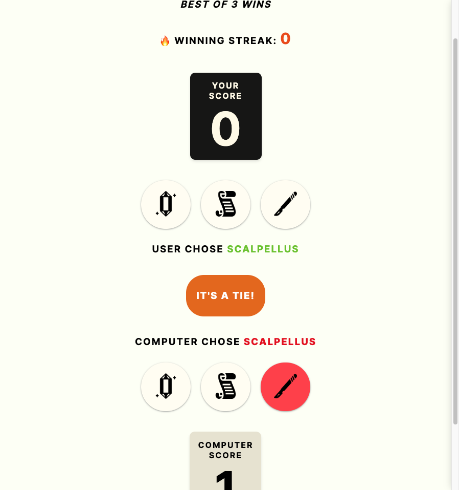

### Lapis, Papyrus, Scalpellus

This mini game is a variation of rock, paper, scissors created using vanilla JavaScript.

#### Features
- Minimalistic design
- Computer logic
- Gameplay visuals
- Win and Lose animation

#### Screenshots
  